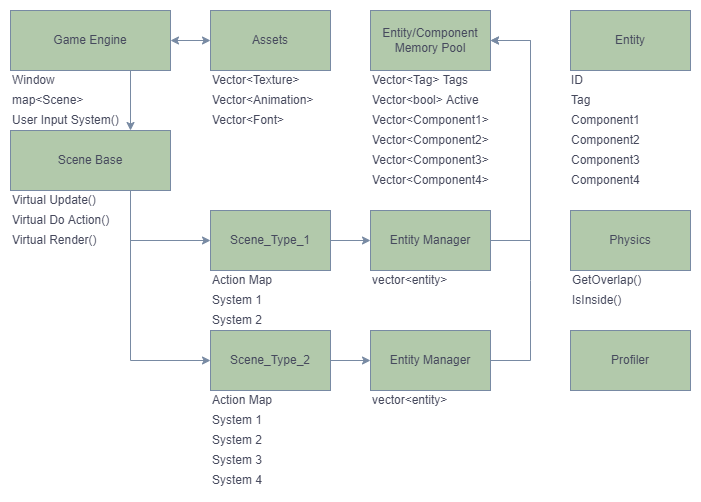

# **About The Project**

This Game Engine is a basic **Entity Component System (ECS)** that uses **RAII (Resource Acquisition Is Initialization)** concepts for memory management and the **SFML Graphics Library** for the window and drawing graphics.

This Game Engine uses data driven design to dynamically load custom configurations, assets, and level data. This means changes can be made to external files to tweak the gameplay at runtime without the need to recompile.

The motivation behind this project was to learn how game engines actually work by implementing one myself.

Currently a basic Mario/Megaman clone has been implemented as a means of testing the concepts mentioned below.

## Basic Architecture



## Assets

- At runtime, Assets are loaded into the Game Engine's Assets System.
- These assets are defined in the *Assets.txt* file and are included in the *bin* folder.
- Current Asset types:
    - `Textures`
    - `Animations`
    - `Fonts`

## Multiple scene types

- There is an abstract base Scene class that contains everything common across all scene types.
- Each Scene will contain it's own Entity Manager, Input/Action map and Systems.
- When a Scene is loaded, its contents (Entities) will be read from a 'level.txt' file.
- Many additional derived scene classes can be created each with their own functionality.
- For example:
    - `Menu Scene`
    - `Gameplay Scene`
    - `Dialogue Scene`
    - `Shop Scene`

## Entities/Components

- In an ECS style engine, components are simply containers for data. Each Scene will have its own systems which will use these componets accordingly.
- Each Entity created will be given appropriate components based on its type and will be assigned animations from the Assets System.
- Current Component types:
    - `Transform`
    - `Lifespan`
    - `Input`
    - `BoundingBox`
    - `Animation`
    - `Gravity`
    - `State`
    - `Draggable`

## Collisions

- The current physics system uses **Axis-Aligned Bounding Box (AABB)** style collision detection.

## Input/Action System

- The Game Engine handles the **Inputs** from hardware such as the keyboard and mouse.

  The Game Engine then looks at the **Action map** in the current scene.
  
  If an **Action** has been registered for that type of input, it creates an **Action object** and sends it immediately to the Scene's **doAction()** function.
- Decoupling the Action from the method of input actually adds several benefits:
  1. We no longer need to write input handling code for each scene.
  2. Each Scene can have its own unique Action Map. This allows us to have different controls depending on the current Scene.
  3. Implementing functionality such as replays or user input mapping will be much easier now.

## Draggable Entities

- The draggable component allows the user to move any tile in the game with the mouse.
- Dragging components happens in real time alongside the game physics system.
- Currently being used as a function of the main game, but in future this can be used to create a level editor tool.

## Memory Pooling

- Using ECS style systems means we are (usually) only doing calculations on one type of component at a time. We can use this fact to speed up our code by **storing components contiguously instead of whole entities contiguously**.
- Memory pooling in this engine works by reserving a series of vectors for each component type as well as vectors for active status and tags. This means that when we look up an entity's component, several components will be cached, **reducing the amount of cache missing that occur on each consecutive lookup**.
- When the Memory Pool is instantiated, we reserve space for a estimated maximum number of entities. Several benefits come from this such as no longer needing to allocate memory on creation of entities and their components, as well as freeing memory when they are removed.

  This works because we can simply mark the Entity and the Component's status to 'false' and whatever data is contained will be ignored. We can then reset the component values when a new entity is added into its place.

- Another benefit of this implementation is that Entities are now just a wrapper around a size_t Entity_ID with some included functions.
- This means:
  1. We can now pass entities by value instead of by reference.
  2. We no longer need to dereference smart pointers.
  3. We haven't changed the way out entities work, simply where the information happens to be stored.
  
  <br>
  Without making any changes to the game implementation memory pooling has made the engine run a whole order of magnitude faster.

  <table>
  <tbody>
  <tr>
    <td><strong>Average update() time before pooling:</td>
    <td>0.330ms</td>
  </tr>
  <tr>
    <td><strong>Average update() time after pooling:</td>
    <td>0.010ms</td>
  </tr>
  </tbody>
  </table>

## Profiling

Profiling is important for finding areas of our code that are taking longer than we expect to run.
Visual Studio does have its own profiling tools, but by coding our own, we can make it compatible with tools such as Google Chome's Tracing visualiser.

First we define a `Profiler` class that starts a timer when its instantiated, and ends a timer/prints the results when its destructed.

Using the following thread safe write function, we can format our results into a JSON format that Chrome Tracer understands.
```C++
void writeProfile(const ProfileResult& result)
{
  std::lock_guard<std::mutex> lock(m_lock);

  if (m_profileCount++ > 0) { m_outputStream << ","; }

  std::string name = result.name;
  std::replace(name.begin(), name.end(), '"', '\'');

  m_outputStream << "\n{";
  m_outputStream << "\"cat\":\"function\",";
  m_outputStream << "\"dur\":" << (result.end - result.start) << ',';
  m_outputStream << "\"name\":\"" << name << "\",";
  m_outputStream << "\"ph\":\"X\",";
  m_outputStream << "\"pid\":0,";
  m_outputStream << "\"tid\":" << result.threadID << ",";
  m_outputStream << "\"ts\":" << result.start;
  m_outputStream << "}";
}
```

Now using some C++ macro magic we can detect the function name automatically
```C++
#define PROFILING 1
#ifdef  PROFILING
#define PROFILE_SCOPE(name) \
		ProfileTimer timer##__LINE__(name)
#define PROFILE_FUNCTION() \
		PROFILE_SCOPE(__FUNCTION__);
#else
#define PROFILE_SCOPE(name)
#endif
```

Now anywhere in our code we can use the following syntax to either time a whole function, or an individual scope, including loop iterations.

```C++
void Scene_Type_1::system1()
{
  PROFILE_FUNCTION();

  {
    PROFILE_SCOPE("Scope1");

    for (auto o : objectsVector)
    {
      PROFILE_SCOPE("Loop iteration");
      // do something here
      
    }// PROFILE_SCOPE("Loop iteration") will end here and then restart at the end of each loop

  } // PROFILE_SCOPE("Scope1") will end here when our added scope ends

} // PROFILE_FUNCTION() will end here at the end of the functions scope
```

<p align="right">(<a href="#top">back to top</a>)</p>

## Assets File Specification

There will be three different line types in the Assets file, each of which
correspond to a different type of Asset. They are as follows:

### **Texture Asset Specification:**

    Texture N P 

<table class="tg">
<tbody>
  <tr>
    <td>Texture Name</td>
    <td>N</td>
    <td>std::string (it will have no spaces)</td>
  </tr>
  <tr>
    <td>Texture FilePath</td>
    <td>P</td>
    <td>std::string (it will have no spaces)</td>
  </tr>
</tbody>
</table>

### **Animation Asset Specification:**

    Animation N T F S 

<table class="tg">
<tbody>
  <tr>
    <td>Animation Name</td>
    <td>N</td>
    <td>std::string (it will have no spaces)</td>
  </tr>
  <tr>
    <td>Texture Name</td>
    <td>T</td>
    <td>std::string (refers to an existing texture)</td>
  </tr>
  <tr>
    <td>Frame Count</td>
    <td>F</td>
    <td>int (number of frames in the Animation)</td>
  </tr>
  <tr>
    <td>Anim Speed</td>
    <td>S</td>
    <td>int (number of game frames between anim frames)</td>
  </tr>
</tbody>
</table>

### **Font Asset Specification:**

    Font N P

<table class="tg">
<tbody>
  <tr>
    <td>Font Name</td>
    <td>N</td>
    <td>std::string (it will have no spaces)</td>
  </tr>
  <tr>
    <td>Font File Path</td>
    <td>P</td>
    <td>std::string (it will have no spaces)</td>
  </tr>
</tbody>
</table>

<p align="right">(<a href="#top">back to top</a>)</p>

## SFML Installation

This engine makes use of SFML which shuld be installed as outlined in the SFML installation instructions found [here](https://www.sfml-dev.org/tutorials/2.5/start-vc.php).

**NOTE:** the SFML path in the project settings is *C:\libraries\SFML-2.5.1* and may need to be updated to your install location.

<p align="right">(<a href="#top">back to top</a>)</p>

## License

Distributed under the MIT License. See `LICENSE.txt` for more information.

<p align="right">(<a href="#top">back to top</a>)</p>

## Contact

Kristian Vines - kvines4@outlook.com

Project Link: [https://github.com/kvines4/SFMLGame](https://github.com/kvines4/SFMLGame)

<p align="right">(<a href="#top">back to top</a>)</p>